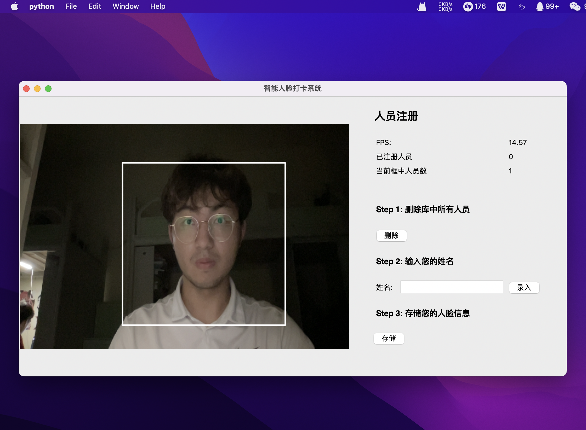
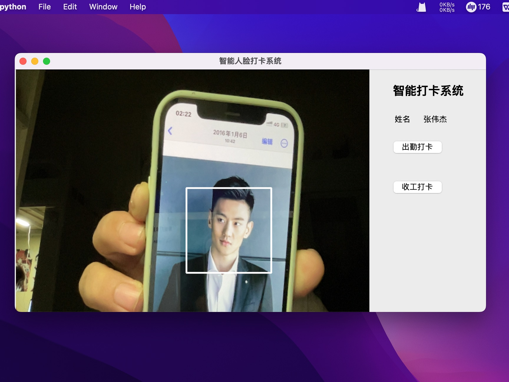
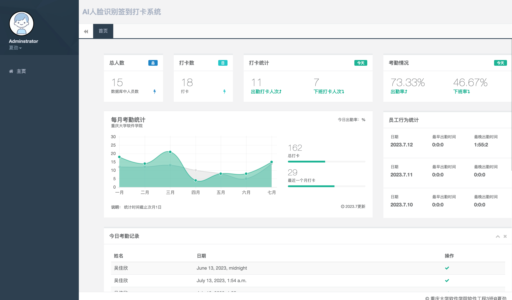

# AI人脸识别打卡系统

自动化打卡管理：该系统可以自动识别员工或学的面部特征，取代传统的手签到方式，提高打卡管理的效率和确性。

防止勤作弊：AI人脸识别技术可以有效防止考勤作弊行为，如代卡、刷卡等，因为每个人的面部特征是独一无的，难以被冒用。

数据统计与分：系统可以收集并析员工或学生的打卡数据生成相关的统计报表，帮助企业或学校进行勤管理、工时统计等工作，提供决策支持。

提升工作效率：通过自动化的打卡管理减少了传统手动签到的时间和人成本，提高了工作效率，使员工学生能够更注于工作或学习任务。

## 使用

- [x] PRELIMINARY

  ```python
  pip -r requirements.txt
  ```

- [x] 录入人脸

  ```python
  python3 get_faces_from_camera_tkinter.py
  ```

- [x] 签到

  ```python
  python3 tkinter_single_face.py
  ```

- [x] 网页运行

  ```python
  python3 manage.py runserver
  ```


## 使用示例
### 人脸录入

### 签到

### Web界面



